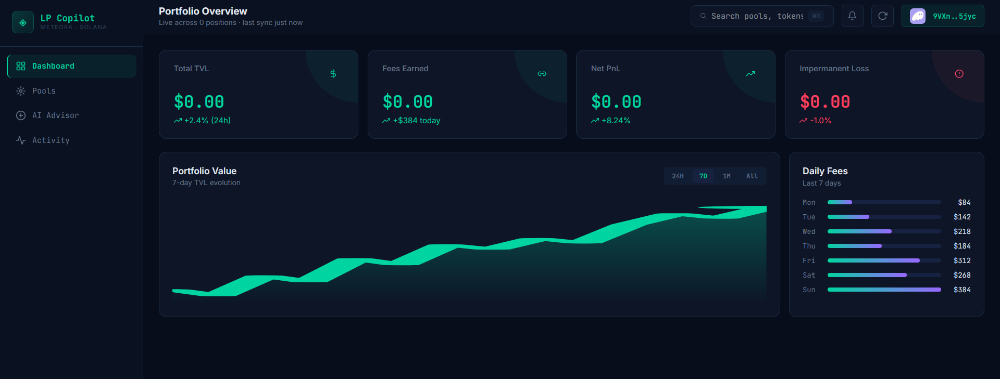

# 🚀 LP Copilot: AI Powered LP Portfolio Dashboard

> Built for the LP Agent Hackathon | Meteora DLMM + DAMM V2 | Solana

🌐 **Live Demo: [lp-copilot.vercel.app](https://lp-copilot.vercel.app)**



---

LP Copilot is an intelligent portfolio tracker and advisor for Liquidity Providers on Solana. It combines real-time LP Agent data with Groq AI to give actionable insights, one-click Zap In/Out, and personalized strategy recommendations.

---

## ✨ Features

| Feature | Description |
|---|---|
| **Portfolio Dashboard** | Real-time TVL, fees, PnL, IL across all positions |
| **AI Portfolio Analysis** | AI analyzes your positions and surfaces actionable insights |
| **Pool Discovery** | Browse Meteora DLMM & DAMM V2 pools with live APR, volume, TVL |
| **AI Pool Recommendations** | Tell the AI your risk profile — it picks the best pools |
| **Zap In** | One-click add liquidity to any pool using just SOL |
| **Zap Out** | Withdraw with preview quotes, choose output token |
| **AI Advisor Chat** | Ask LP strategy questions with your full portfolio as context |
| **Transaction History** | Full log of all real on-chain LP activity |

---

## 🛠️ Tech Stack

| Layer | Tech |
|---|---|
| Frontend | React 18, Vite, Custom SVG Charts |
| Backend | Node.js, Express 4 |
| AI | Groq API (Llama 3.3 70B) |
| Blockchain | Solana Wallet Adapter, @solana/web3.js |
| LP Data | LP Agent Open API (12 endpoints) |
| TX Landing | Jito Bundles |

---

## 📡 LP Agent API Endpoints Used

| Endpoint | Purpose |
|---|---|
| `GET /lp-positions/opening` | Open positions for wallet |
| `GET /lp-positions/overview` | Portfolio metrics and win rate |
| `GET /lp-positions/revenue` | PnL over time (7D/1M) |
| `GET /lp-positions/logs` | Transaction history |
| `GET /pools/discover` | Pool discovery with filters |
| `GET /pools/:id/info` | Pool details and active bin |
| `GET /pools/:id/top-lpers` | Top LP providers (Premium) |
| `POST /pools/:id/add-tx` | **Zap-In** — generate unsigned txs |
| `POST /pools/landing-add-tx` | **Zap-In** — land via Jito bundles |
| `POST /position/decrease-quotes` | **Zap-Out** — preview quotes |
| `POST /position/decrease-tx` | **Zap-Out** — generate unsigned txs |
| `POST /position/landing-decrease-tx` | **Zap-Out** — land via Jito bundles |

---

## 📁 Project Structure

```
lp-copilot/
├── backend/
│   ├── server.js          ← Express API (all routes inline)
│   ├── package.json
│   ├── railway.json       ← Railway deployment config
│   └── .env               ← Your secret keys (never on GitHub)
├── frontend/
│   ├── src/
│   │   ├── App.jsx        ← Full React app (dashboard, pools, AI, activity)
│   │   ├── index.css      ← Global styles
│   │   └── main.jsx       ← Wallet adapter providers
│   ├── index.html
│   ├── vite.config.js
│   └── package.json
├── assets/
│   └── dashboard.png      ← App screenshot
└── README.md
```

---

## 🚀 Quick Start

### 1. Clone

```bash
git clone https://github.com/Paulos-ui/lp-copilot
cd lp-copilot
```

### 2. Backend Setup

```bash
cd backend
npm install
```

Create `backend/.env`:
```
LP_AGENT_API_KEY=your_lp_agent_key
GROQ_API_KEY=your_groq_key
FRONTEND_URL=http://localhost:3000
PORT=4000
```

Get your keys:
- **LP Agent** → [portal.lpagent.io](https://portal.lpagent.io) then DM [@thanhle27](https://t.me/thanhle27)
- **Groq** → [console.groq.com](https://console.groq.com) (free)

```bash
npm start
# Backend on http://localhost:4000
```

### 3. Frontend Setup

```bash
cd frontend
npm install
```

Create `frontend/.env`:
```
VITE_API_URL=http://localhost:4000/api
```

```bash
npm run dev
# Frontend on http://localhost:3000
```

---

## 🌐 Deployment

| Service | Purpose | Config |
|---|---|---|
| **Railway** | Backend API | Root Directory: `backend`, Start: `node server.js` |
| **Vercel** | Frontend | Root Directory: `frontend`, Framework: Vite |

**Railway Variables:**
```
LP_AGENT_API_KEY = your_key
GROQ_API_KEY     = your_key
```

**Vercel Variables:**
```
VITE_API_URL = https://your-backend.railway.app/api
```

---

## 🔄 Zap In Flow

```
User enters SOL amount
        ↓
GET /pools/:id/info  →  find active bin
        ↓
POST /pools/:id/add-tx  →  unsigned transactions
        ↓
wallet.signTransaction()  →  signed transactions
        ↓
POST /pools/landing-add-tx  →  Jito bundles  →  On-chain ✅
```

## 🔄 Zap Out Flow

```
User selects position + %
        ↓
POST /position/decrease-quotes  →  preview amount
        ↓
POST /position/decrease-tx  →  unsigned transactions
        ↓
wallet.signTransaction()  →  signed transactions
        ↓
POST /position/landing-decrease-tx  →  Jito  →  On-chain ✅
```

---

## 🏆 Hackathon Submission

- ✅ Uses 12 LP Agent API endpoints
- ✅ Zap-In integrated (generate + land via Jito)
- ✅ Zap-Out integrated (quotes + generate + land via Jito)
- ✅ AI advisor powered by real LP Agent portfolio data
- ✅ Live demo at [lp-copilot.vercel.app](https://lp-copilot.vercel.app)

Built with ❤️ for the LP Agent Hackathon